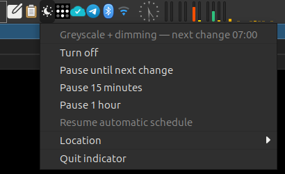

# myflux

Nightly screen colour management for X11 on amdgpu: redshift during the
evening and early morning, plain greyscale plus dimming through the middle
of the night.

**Requirements:** [`redshift`](https://packages.debian.org/source/sid/redshift)
must already be installed; myflux drives it rather than replacing it.



## Schedule

```
   sunset ──redshift──► 22:30 ──greyscale + dimming──► 07:00 ──redshift──► sunrise
```

* **sunset → 22:30** — redshift, exactly as before (colour temperature and
  its own `-b` dimming).
* **22:30 → 07:00** — greyscale and dimming, *no* colour shift. redshift is
  stopped for the whole window.
* **07:00 → sunrise** — redshift again.

If sunset falls after 22:30, or sunrise before 07:00, the corresponding
redshift phase simply does not happen. This needs no special handling: at the
boundary redshift is already sitting at neutral 6500 K, so stopping or
starting it has no visible effect.

Greyscale runs to 07:00 unconditionally, regardless of sunrise. Near the
Amsterdam solstice that means a grey screen for the hour or so between
sunrise and 07:00. That is deliberate.

Transitions take about 2.5 seconds, matching redshift's own built-in fade, so
the two stages move together.

## Design

The two effects live in **different hardware stages**, which is what makes
this work:

```
   framebuffer ──► DEGAMMA_LUT ──► CTM ──► GAMMA_LUT ──► display
                                    ▲          ▲
                                 myfluxd    redshift
```

They are independent: `redshift` writes the gamma LUT and never touches the
CTM; `ctmset` writes the CTM and never touches gamma. Both can be active at
once, which is why the crossfade is possible at all.

Greyscale and dimming are a single 3×3 matrix:

```
   M = brightness · [ (1-g)·I + g·luma ]        luma = Rec.709 (0.2126, 0.7152, 0.0722)
```

With `g=0` this is exactly the identity. With `g=1` every row is the luma row,
so output is neutral for any input. Each row of the bracket sums to 1 and
`brightness ≤ 1`, so no row sum ever exceeds 1 and the matrix cannot clip.

Note the CTM operates on encoded (non-linear) values here, since DEGAMMA_LUT
is bypassed. That makes the greyscale a luma approximation rather than a
strictly linear-light one — the same approximation redshift makes, and the
usual one for this kind of adjustment.

### No solar math

`myfluxd` never computes sun position. redshift already does it, so redshift
is left running continuously and simply **stopped** during the grey window;
it works out sunset and sunrise by itself on either side. The daemon knows
only two wall-clock times.

### Robustness

Every tick (15 s) the daemon re-derives the wanted state from the clock and
enforces:

```
   redshift running  iff  outside the grey window and not overridden
   CTM               ==   the matrix above
```

Nothing is accumulated, so a *missed* boundary is self-correcting: waking from
suspend at 02:00 takes the same code path as starting fresh at 02:00. The CTM
is reasserted on every tick while grey, so VT switches and monitor hotplug
heal themselves, and the matrix is applied to every connected output.

Resume is additionally detected by comparing wall-clock against monotonic
drift (Linux `CLOCK_MONOTONIC` excludes time spent suspended). On resume
redshift is restarted, because X can drop gamma ramps across DPMS and VT
switches.

## Install

Requirements (Debian package names):

* **Display:** an X11 session on a GPU whose driver exposes the `CTM` output
  property through RandR — amdgpu here. Wayland is not supported.
* **Runtime:** [`redshift`](https://packages.debian.org/source/sid/redshift),
  `python3`, `x11-xserver-utils` (for `xrandr`), `procps` (for `pkill`), and
  a systemd user session.
* **Build:** a C compiler and `make` (`build-essential`), `libx11-dev`,
  `libxrandr-dev`.
* **Tray (optional):** `python3-gi`, `gir1.2-gtk-3.0`,
  `gir1.2-ayatanaappindicator3-0.1`, and a panel that hosts
  StatusNotifierItem icons, such as `xfce4-panel`'s systray plugin (see
  [Tray indicator](#tray-indicator)).

```sh
sudo apt install redshift python3 x11-xserver-utils procps \
    build-essential libx11-dev libxrandr-dev \
    python3-gi gir1.2-gtk-3.0 gir1.2-ayatanaappindicator3-0.1
```

```sh
make            # build ctmset and ctmget
make install    # symlink into ~/bin, link the unit, daemon-reload
systemctl --user enable --now myfluxd.service
```

`make uninstall` disables the service and removes the symlinks, leaving
this directory alone. It keeps `~/bin/myflux`, so your location choice
survives a reinstall.

The service is bound to `default.target`, not `graphical-session.target`,
which lightdm does not activate here. It sets `DISPLAY=:0.0` explicitly;
`~/.Xauthority` is the default path and needs no `XAUTHORITY`.

## Usage

```sh
myfluxctl status           # what is active right now
myfluxctl off              # all effects off, until further notice
myfluxctl off 45m          # ...for a while, then resume  (also 90s, 2h)
myfluxctl off next         # ...until the next schedule boundary
myfluxctl on               # resume the automatic schedule
myfluxctl toggle           # off if on, on if off (handy for an i3 binding)
myfluxctl loc ams          # switch location (ams, nyc, tok, toronto)
myfluxctl reset            # escape hatch; works with the daemon stopped
```

"Off" means *everything* off — identity CTM and no redshift, so full colour
and full brightness. A timed override clears itself when it expires.
Stopping the service (`systemctl --user stop myfluxd`) also restores full
colour on the way out.

`myfluxctl reset` is the last resort if the daemon is not running: it kills
redshift, resets gamma, and writes the identity matrix to every connected
output. If the daemon *is* running it will reassert the schedule on its next
tick.

### Location

Location is the `~/bin/myflux` symlink, pointing at one of the
`myflux-<place>` scripts — the long-standing convention here. `myfluxctl loc`
repoints it atomically; the daemon notices within a tick and restarts
redshift, so there is no longer any need to kill it by hand when changing
cities.

The 22:30 and 07:00 boundaries follow the **system timezone**, so
`timedatectl set-timezone` covers that half automatically. Keep the two in
agreement: a symlink pointing at `nyc` while the timezone says
`Europe/Amsterdam` means redshift computes sunset for the wrong continent.

Note `myflux-tok` and `myflux-toronto` carry no `-b`, so they do not dim
during the redshift phase. The grey window dims regardless of location.

## Tray indicator

`myfluxtray` is a StatusNotifierItem indicator: current phase as the icon, and
a menu for the same actions `myfluxctl` exposes (pause 15 min / 1 h / until the
next boundary, turn off, resume, switch location). Middle-click toggles.

It autostarts via `~/.config/autostart/myfluxtray.desktop`, generated by
`make install` from `myfluxtray.desktop.in`. Run `myfluxtray &` to start it
without logging out. `MYFLUX_TRAY_DEBUG=1` traces every refresh to stderr.

The icons are generated, not used straight from the theme. A themed icon name
carries no geometry, so the only way to give the icon horizontal breathing
room in the panel is to hand it a wider canvas: at startup the tray copies
each symbolic SVG into `~/.cache/myflux/icons/` with the `viewBox` and `width`
widened by `MYFLUX_ICON_PAD` units (default 2) on each side, leaving the
artwork untouched, and points the indicator at that directory. The
`-symbolic` suffix is preserved so GTK still recolours them to the panel
foreground rather than baking in the source grey.

Note the padding is in the icon's own units, on a 16-unit canvas — so it is
2 px only when the panel draws the icon at 16 px, and scales with it
otherwise (about 2.75 px at a 22 px panel). Tune with `MYFLUX_ICON_PAD`;
set it to `0` to use the theme icons unmodified. Anything that cannot be
rewritten (a PNG-only icon, say) silently falls back to the plain theme name.

It is **event-driven, not polled**. The daemon writes `state` only when
something actually changes, and the tray watches that directory with inotify
(GFileMonitor), so an idle night costs no wakeups at all — measured: zero
events across 30 s of idle, where the earlier every-tick write produced ~8.
Daemon liveness is re-checked when the menu opens, which is user-driven and
therefore also free while idle; `Restart=always` covers an unclean death.

This depends on `xfce4-panel`'s systray plugin, which provides the
StatusNotifierItem watcher. There is no XEmbed tray on this session
(`_NET_SYSTEM_TRAY_S0` is unowned), so `Gtk.StatusIcon` would silently do
nothing and is deliberately not used as a fallback. If you ever replace the
panel with bare `i3bar`, which speaks XEmbed and not SNI, the icon will
disappear without an error.

Note `myfluxtray` has no dash in its name on purpose: `myflux-*` is the
location-script glob, and a `myflux-tray` would show up as a selectable
location.

## Configuration

Set in `myfluxd.service` (then `systemctl --user daemon-reload && restart`):

| Variable | Default | Meaning |
|---|---|---|
| `MYFLUX_GREY_START` | `22:30` | grey window start, inclusive |
| `MYFLUX_GREY_END` | `07:00` | grey window end, exclusive |
| `MYFLUX_GREY_BRIGHTNESS` | `0.5` | brightness across the grey window |
| `MYFLUX_CTMSET` | — | override the path to `ctmset` |

A window where start < end is treated as same-day rather than wrapping.

## ctmset / ctmget

`ctmset` sets the RandR `CTM` output property, which `xrandr --set` cannot do:
it is a 9-element S31.32 sign-magnitude blob, not a scalar.

```sh
ctmset eDP 1 0 0  0 1 0  0 0 1                        # identity
ctmset eDP 0.2126 0.7152 0.0722  ...  # (×3 rows)     # Rec.709 greyscale
ctmget eDP                                            # read it back
```

**`xrandr --prop` misreports the CTM.** Any coefficient whose fractional part
is ≥ 0.5 prints as `-2147483647.xx`. Xlib sign-extends the CARD32 into a
`long` on readback — documented format-32 behaviour — and xrandr's printing
does not mask it, so the low word clobbers the high word. The stored bits are
correct and the hardware gets a valid matrix; only the display is wrong.
`ctmget` masks properly and is the reliable way to check. This is easy to
mistake for a bug in `ctmset`, which is why `ctmget` exists.

## Files

| File | Purpose |
|---|---|
| `myfluxd` | the daemon |
| `myfluxctl` | status, overrides, location |
| `myfluxd.service` | systemd user unit |
| `ctmset.c` | write the CTM output property |
| `ctmget.c` | read it back, masking correctly |
| `myfluxtray` | tray indicator (StatusNotifierItem) |
| *(generated)* | padded icons in `~/.cache/myflux/icons/`, rebuilt at each start |
| `myfluxtray.desktop.in` | autostart template, `@BIN@` substituted on install |
| `myflux-*` | per-location redshift invocations |

Runtime state lives in `~/.config/myflux/`: `state` (JSON, rewritten only when
something changes) and `override` (present only while overridden).
